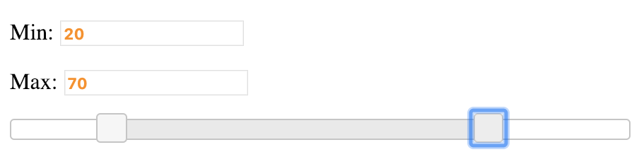

# Range Slider

## Implement a slider input

Main goal:

- Implement a Slider form control with one handle
- Click on a certain position should move tha handle to that point
- It should have an input showing selected value
- On hover you should see a tooltip with current value

Stretch goal:

- If you change input value slider thumb should be placed accordingly
- Implement drag-n-drop functionality for slider
- Add second handle
- Max handle should always be not less then Min one

You can see an example [here](https://jqueryui.com/slider/#range)

### Screenshot of the 

---

**Result**

- [DEMO LINK](https://coroboX.github.io/js_range-slider-DOM/)
